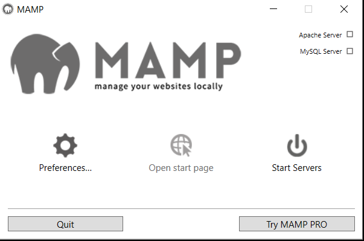
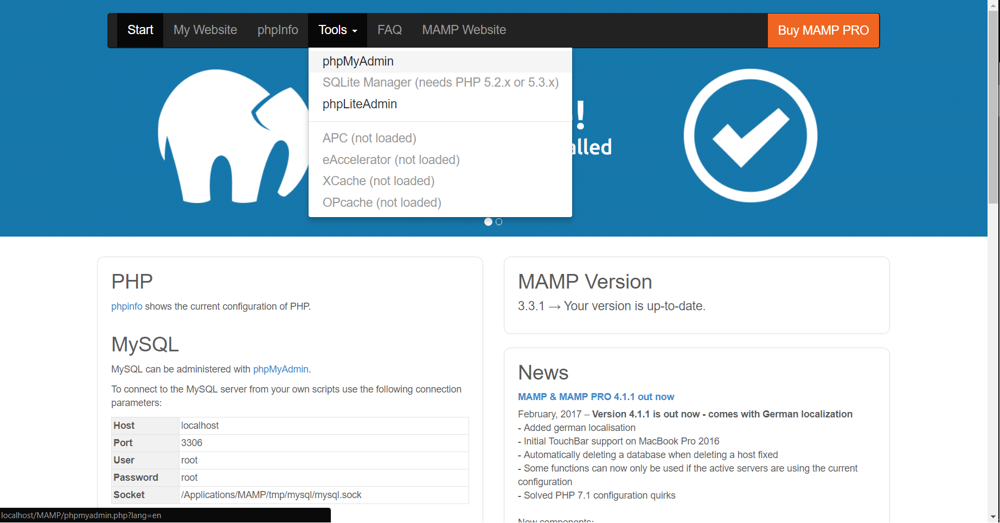
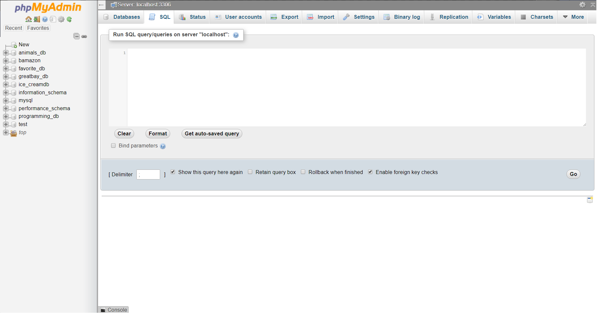
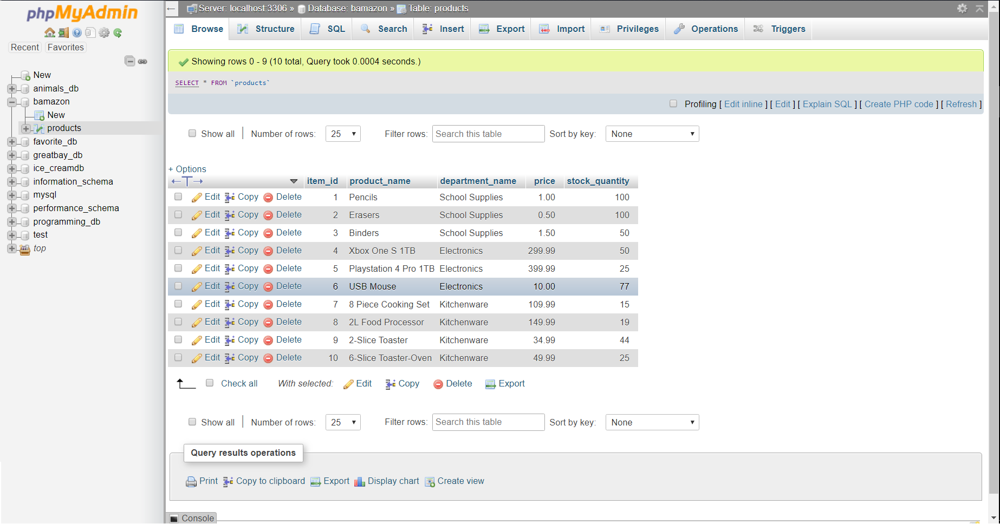
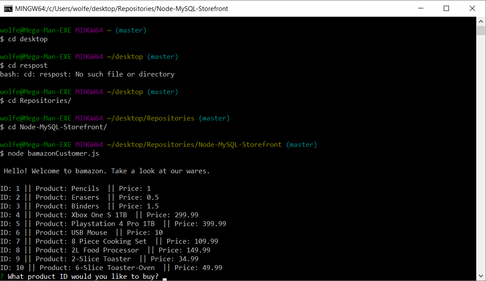
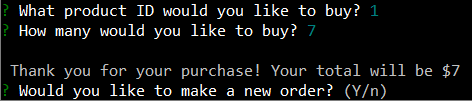
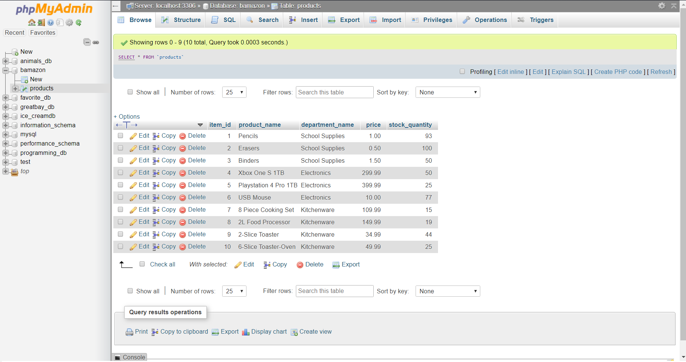

# bamazon: A Node-MySQL Storefront

## Description

This project provides a simulated version of amazon that is accessed and utilized via the GitBash Terminal. The simulation allows a user to go through a sample format of an online store, select a product and quantity, "order" it, and have the total cost read back to them in the console.

## Purpose

The purpose of this project was to practice utilizing Node.JS, servers, and MySQL databases together, along with npm packages, that are acting and reacting in real-time with each other. This is a fundamental method to understand databases and how to use them, in particular with MySQL

## How to Use This Application

**BEFORE YOU START:** Utilizing your Git Bash Terminal, after navigating to the folder containing the files, you'll need to install three npm packages:

```
npm init install
npm install inquirer
npm install mysql
```

**You will also need to be able to link into your own MySQL database into the "bamazonCustomer.js" file**

### Step 1



Open Mamp, and click the "Start Server" button. Once that's running and stays green, click "Open start page".

### Step 2



Once the pages loads, click the tab labeled "Tools", and then select "phpMyAdmin".

### Step 3



On the left hand side of the window, click on "new", and then either the "SQL" or the "Import" tab. If you select the "SQL" tab, you can copy and paste everything from the "bamazon.sql" into the text box and hit go; if you select the "Import" tab, you can select you can follow the instruction listed under that tab to select the "bamazon.sql" file, and import a table like that. 

### Step 4



If submitted correctly, a database labeled "bamazon" should be present after clicking the green arrow in the top left corner. Expand on the "bamazon" database,  select the table labeled "products" underneath in, and then select the tap labeled "Browse". You should see a table like the one pictured above.

### Step 5



Go into you Git Bash terminal, and from there navigate to the folder that is storing all the project files. Input the command 'node bamazonCustomer.js'. A list of products will appear, along with their ID's and prices. 

### Step 6



The first question will ask you to input a product ID, from 1 to 10. Afterwards, it will ask a for a quantity.

If quantity asked is larger than the available stock, it will say `Insufficient quantity!`, and ask you to make another selection. If there is enough stock to meet the demand, it will log the total of your purchase.

Afterwards, you'll have the option to either make another order, or end the connection with the database. 

### Step 7



After each "purchase" made, it will update the "stock_quantity" column in your "products" table in MySQL. In this example, the initial stock for pencils went from 100 to 93.

## Node Packages Used

* [inquirer](https://www.npmjs.com/package/inquirer)
* [mysql](https://www.npmjs.com/package/mysql)

## Other Technologies Used

* MAMP
* Node.JS
* MySQL
* Git Bash